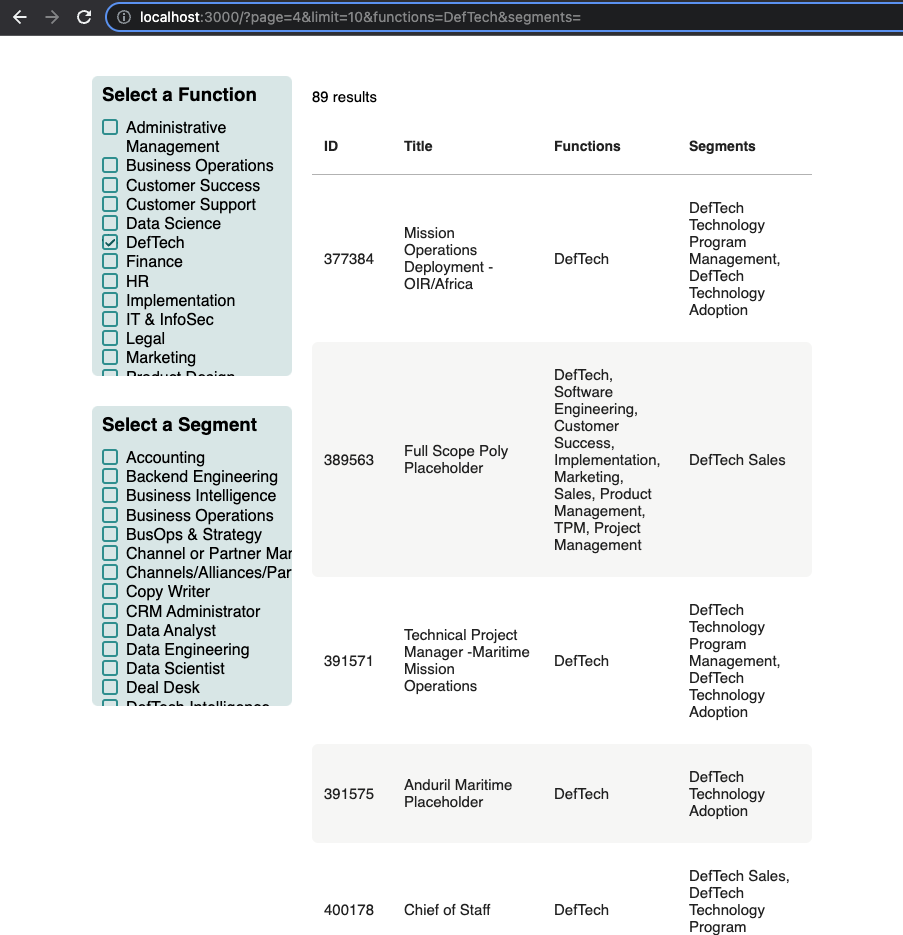

# Table Pagination & Filters via URL Params

The goal of this take home assessment is to finish the setup of pagination and filtering for a table. You must use URL query parameters to store the state (Whether or not the table is loading is an exception).



### Definitions
- Page: the current page the table is on
- Limit: the number of rows per page to display

### Assumptions
- The pagination component is already built. You only need to pass it the current page and a function to update the current page (see component).
- The table component is already built
- The filter box component is already built. You only need to pass it selected values (see component).
- You do not need to worry about changing/tracking the limit
- You only need to worry about the two filters: functions and segments. 
- The data returned from getCollection() is in the following format:

```json
{
  "items": [
    {
      "id": 13426,
      "title": "Mission Success",
      "functions": ["DefTech", "Customer Success"],
      "segments": ["DefTech Technology Adoption"]
    },
    {
      "id": 85492,
      "title": "Mission Development",
      "functions": ["DefTech", "Customer Success", "Sales"],
      "segments": ["DefTech Sales"]
    }
    ...
  ],
  "total": 230
}
```

### Requirements

- You use a custom hook to handle the table logic (URL state, fetching data using `getCollection`, etc). You may create your own, modify the existing hook, or a combination of the two.
- You use URL Query Parameters to preserve state (purpose: you should be able to send the URL to someone and the table loads the data according to the specified query parameters)
- You can navigate forward and backward in history and the table loads accordingly
- Adding/Removing a filter sets you back to page 1
- You can navigate through the pages via the Pagination component

### Nice to Haves

- You track whether or not the table is loading (`progressPending` prop for Table)
- Logic to handle multiple tables on page (example: two separate job boards on the same page. How do you handle the URL params if table X is on page 1 and table Y is on page 3?)
- Prettier UI

### Fetching Data

There is a `getCollection` function inside `/data/api`. It accepts a single parameter, an object containing the current table parameters.

An example of params might be:

```json
{
  "page": 1,
  "functions": ["Software Engineering", "Customer Success"],
  "segments": ["Full-Stack Engineering"]
}
```

### The Existing Components

#### FilterBox

The FilterBox component displays a list of filters that can be toggled via a checkbox.

| Prop              | Type       | Description                                                                                        |
| :---------------- | :--------- | :------------------------------------------------------------------------------------------------- |
| `label`           | `string`   | **Required**. The name to display for this filter box.                                             |
| `id`              | `string`   | **Required**. A unique id for this filter box.                                                     |
| `handleFilter`    | `func`     | **Required**. A function that handles storing the state of this filter.                            |
| `options`         | `string[]` | **Required**. A string array of options (ex: `["Software Engineering", "Customer Success"]`).      |
| `selectedOptions` | `string[]` | **Required**. A string array of actively selected options (ex: `["Finance", "Customer Success"]`). |

#### Pagination

The pagination component displays controls for moving backward and forward between pages, as well as page numbers to jump to.

| Prop           | Type     | Description                                                                     |
| :------------- | :------- | :------------------------------------------------------------------------------ |
| `total`        | `number` | **Required**. The total number of results in the data.                          |
| `limit`        | `number` | **Required**. The number of results to show per page.                           |
| `onChangePage` | `func`   | **Required**. A functon that handles changing the page of the associated table. |
| `currentPage`  | `number` | **Required**. The current page.                                                 |

#### Table

The table component displays a table using `react-data-table-component`.

| Prop              | Type      | Description                                                                                                     |
| :---------------- | :-------- | :-------------------------------------------------------------------------------------------------------------- |
| `columns`         | `array`   | **Required**. An array of columns to use for displaying the data.                                               |
| `total`           | `number`  | The total number of results in the data.                                                                        |
| `data`            | `array`   | An array of data to display. This will always be the `items` property of the data returned from getCollection() |
| `progressPending` | `boolean` | A boolean indicating if the table is loading.                                                                   |
